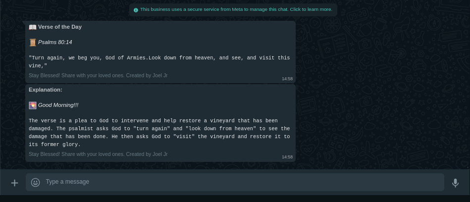

# Seyfert

Seyfert is more than just a simple WhatsApp bot. It is a journey companion that brings you closer to the word of God, guiding you through the wisdom and beauty of biblical verses.



## Requirement

- [Node.js](https://nodejs.org/) installed on your machine
- [WhatsApp Business API](https://developers.facebook.com/docs/whatsapp/cloud-api/overview) account with a valid token
- Create a template message on [WhatsApp Business API](https://developers.facebook.com/docs/whatsapp/cloud-api/overview)

### Template: ```random_verse```

```
📖 *Verse of the Day*

📜 _{{1}}_

```"{{2}}"```
```

### Template: ```explain_verse```
```
*Explanation:*

🌄 _Good Morning!!!_

```{{1}}```
```

> [!NOTE]
> Templates must follow this structure to avoid errors.

## Instalation
1. Fork this repository
2. install

```bash 
npm install 
```
```bash
pnpm install
```
3. Rename `.env.example` to `.env`
4. Open `.env` file and fill in the required fields (API keys, token, etc.)
```env
# Whatsapp configuration
# For Whatsapp credentials, visit: https://developers.facebook.com/

# Number to which messages will be sent
SEND_TO = "1234567890"  

# Origin phone number ID
FROM_PHONE_NUMBER_ID = "0987654321"  

# WhatsApp access token
TOKEN_WHATSAPP = "xxxxxxxxxxxxxxxxxxxxxxxxxxxxxxxxxx"  

# WhatsApp version used
WHATSAPP_VERSION = "v19.0"  

# Bible API
# For more information about the Bible API, visit: https://bible-api.com
BIBLE_API = "https://bible-api.com"  # Base URL of the Bible API

# Google Gemini API
GEMINI_API_KEY = "wngwngknlgkanNKNKNKNkndnkwddwd"
```
5. Save the changes

## Usage

Run ``` pnpm run dev``` or ```npm run dev```

## Contribution

If you want to contribute to this project, follow the steps below:

1. Fork the project
2. Create a Branch for your Feature (`git checkout -b feature/AmazingFeature`)
3. Add your changes (`git add .`)
4. Commit your changes (`git commit -m 'Add some AmazingFeature'`)
5. Push the Branch (`git push origin feature/AmazingFeature`)
6. Open a Pull Request

## License

Distributed under the MIT License. See [LICENSE](./LICENSE) for more information.